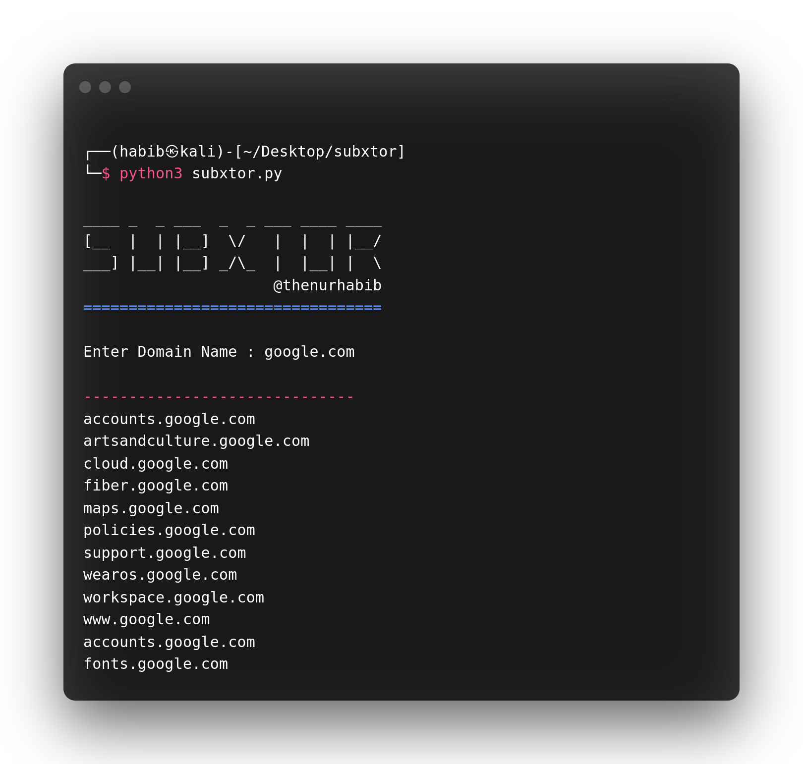

<h1 align="center">
 
  subXtor

</h1>

<h4 align="center">Fastest Subdomain Finder.</h4>

<p align="center">
  <a href="https://github.com/thenurhabib/subxtor/releases">
    
  </a>
  <a href="https://travis-ci.com/thenurhabib/subxtor">
    
  </a>
  <a href="https://github.com/thenurhabib/subxtor/issues?q=is%3Aissue+is%3Aclosed">
      
  </a>
</p>



<hr>

### subxtor is a fastest tool to find subdomain via dork.

### Main Features
- Subdomain Enumeration.
- Faster than any other subdomain enumeration tool
- Easy to use.
- No Required modules.


<br>


### Documentation
### install
```yaml
git clone https://github.com/thenurhabib/subxtor.git
cd subxtor
```


#### Usage

```yaml
python3 subxtor.py
```
<br>


### Author
```yaml
Name       : Md. Nur habib
Medium     : thenurhabib.medium.com
Twitter    : https://twitter.com/thenurhab1b
HackerRank : https://www.hackerrank.com/thenurhabib

```

##### Thank You.
